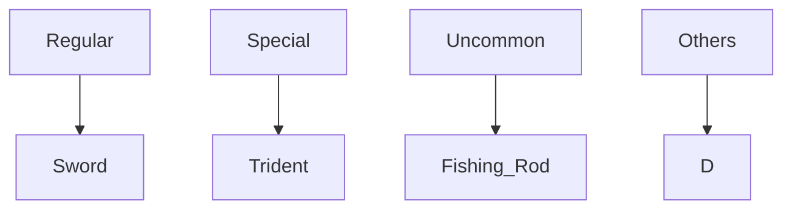

# Series
| **Raymond** | - | **Original** | - | **Spin-off** | 
| :---:         |     :---:      |          :---: | :---: |          :---: |
|  Raymond's Rebeginning  |   Protectors of the Realm   |  y  |  y| y |
|  Sheen Stories    | Christ Over Rome Before and After    |   h    | h | h |
| Omega Odyssey     |    y     |   y    |  y|  y|
| Caballero Chapters       |   y    | y |  y |  y |

# Concepts
## Royal & Loyal Order 
A group above the Imperialist and Experialist and it embodies the abstract concept of the Superialist because 
the Superial army is only small but mixed with other government armies. It is like the Knights Templar, it is one of the groups that 
answers directly to the king and it is quite well organized.

Here is a simple flow chart:

l\genres
r
